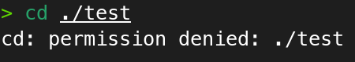
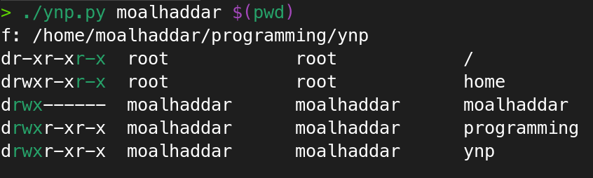
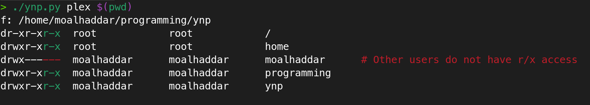

 


# ynp
Why no permission (ynp) is a python utility script that helps you find out why a certain user does not have read access to a certain file or directory in linux.

# How it works
The script depends on `namei` utility from `utils-linux` package, it executes the utility then parses the output then colors the permissions and gives hints based on some logic.

# Usage
```sh
> ./ynp.py
	Usage: python3 ynp.py <username> <path>

> python3 ./ynp.py root <path>
```

# The logic
- A user can list the contents (only list dir, not read the contents of files) of a directoy only if they have read (r) permission on the said directory.
Example of this on a directory `test` with mode `rwx---r--`:

```sh
> ls -l
total 1
drwx---r--. 1 plex       plex         14 Oct  4 16:51 test
> whoami
moalhaddar
> cd ./test
cd: permission denied: test
> ls ./test
hello.c
> ls -l ./test 
ls: cannot access './test/hello.c': Permission denied # ls command trying to acccess the metadata of hello.c and failing
total 0
-????????? ? ? ? ?            ? hello.c
```

- A user can access the files/directories inside a directory if they have execute (x) permission on the said directory.
```sh
> ls -l
total 1
drwx---r--. 1 plex       plex         14 Oct  4 16:51 test
> sudo chmod 705 ./test
> ls -l ./test # Didn't work earlier without x bit!
total 4
-rw-r--r--. 1 plex plex 10 Oct  4 17:04 hello.c
```

**we realize that a user can only access fully access a directory and it's files if they have at least read and execute permission**

Also, parent dirs permissions matter, read [this stackexchange answer](https://unix.stackexchange.com/a/13891) for more info.

### Summary: to have access to a file through an absolute path, you need at least r-x permission throughout the entire path directories, and at least r-- on the file itself (if the terminal component is a file).

The command `namei -l PATH` can help us find the path components with their permissions.

```sh
> namei -l $(pwd)
f: /home/moalhaddar/programming/ynp
dr-xr-xr-x root       root       /
drwxr-xr-x root       root       home
drwx------ moalhaddar moalhaddar moalhaddar
drwxr-xr-x moalhaddar moalhaddar programming
drwxr-xr-x moalhaddar moalhaddar ynp
```

The ynp script is interested in this output, then parses and colors the permissions accordingly. 

Example of a successful access to a folder as the user `moalhaddar`



Example of a failed access to a folder as the user `plex`, reason is also printed out



# Misc info
You can find the groups that your user belongs to by using the `groups <username>` command

```sh
> groups plex      
plex : plex # group_name1 group_name2 etc.. 
```

However, if you remove your user from a group, the groups of the current effective session are not changed. You need to logout the current user from **all the sessions** for the new groups to take effect. You can find the effective groups using the `id` command:

```sh
> id
uid=990(plex) gid=1010(plex) groups=1010(plex)
                            #       ^ effective groups
```

# Cases that are unsupported/untested
- Hard & soft links

# Author
Mohammed Alhaddar

# License
MIT